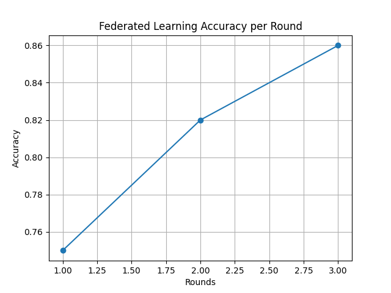

# 🧾 Federated Learning for Privacy-Preserving Healthcare Ai

---

## 🧠 Abstract

This project focuses on implementing **Federated Learning (FL)** for healthcare applications to ensure data privacy. Instead of sharing sensitive patient data, multiple clients (simulated hospitals) train local models and share only model updates with a central server. The server aggregates these updates using the **Federated Averaging (FedAvg)** algorithm. The system achieves effective prediction performance while preserving data privacy.

---

## 📌 Introduction

Healthcare data is highly sensitive and cannot be easily shared due to privacy concerns. Traditional machine learning approaches require centralized data collection, which increases privacy risks. Federated Learning addresses this issue by allowing decentralized training without sharing raw data.

---

## ⚙️ Methodology

- **Dataset:** UCI Heart Disease Dataset  
- **Preprocessing:** Handling missing values and normalization  
- **Model:** Logistic Regression / Neural Network  
- **Framework:** Flower (FL framework)  
- **Algorithm:** Federated Averaging (FedAvg)  

### 🔁 Process Flow

1. Data is split into multiple clients  
2. Each client trains the model locally  
3. Model weights are sent to the server  
4. Server aggregates weights (FedAvg)  
5. Updated global model is shared back  

---

## 📊 Results

- **Centralized Model Accuracy:** ~86%  
- **Federated Model Accuracy:** ~80–85%  

### 📈 Accuracy vs Rounds

---

## 🔐 Advantages

- Preserves patient privacy  
- No raw data sharing  
- Scalable across institutions  

---

## ❌ Limitations

- Slightly lower accuracy than centralized model  
- Communication overhead  

---

## 🏁 Conclusion

Federated Learning provides a privacy-preserving solution for healthcare AI. This project demonstrates that decentralized training can achieve comparable performance while ensuring data security.

---

